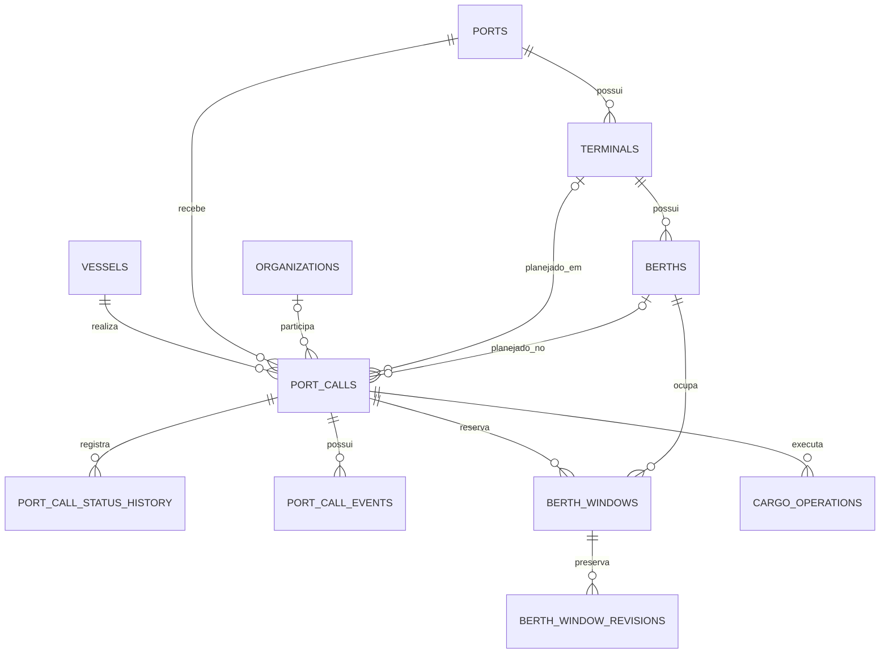

# Modelo de dados inicial

Esta etapa transforma as regras do domínio em um modelo relacional PostgreSQL. As tabelas ficam isoladas no schema `port_management` e usam nomes em `snake_case`.

## Visão dos relacionamentos



## Tabelas

- `vessels`: navios e suas características operacionais.
- `organizations`: autoridades, terminais, operadores, armadores e agências.
- `ports`, `terminals` e `berths`: estrutura física e limites de compatibilidade.
- `port_calls`: escala, situação atual, planejamento e versão de concorrência.
- `port_call_status_history`: transições de situação em histórico append-only.
- `port_call_events`: estimativas, solicitações, planos e eventos realizados sem sobrescrita silenciosa.
- `berth_windows`: período atual solicitado ou confirmado para um berço.
- `berth_window_revisions`: períodos anteriores e justificativas de reprogramação.
- `cargo_operations`: operação, carga, quantidade, unidade e indicação de carga perigosa.

## Proteções aplicadas no banco

- IMO único entre navios ativos, quando informado.
- UN/LOCODE de porto único.
- código público e chave de idempotência únicos por escala.
- chaves estrangeiras com exclusão restrita para cadastros históricos.
- `CHECK` para períodos válidos e quantidades não negativas.
- token de concorrência otimista na escala.
- extensão `btree_gist` e restrição de exclusão para impedir janelas confirmadas sobrepostas no mesmo berço.

A restrição de sobreposição usa intervalos semiabertos `[início, fim)`. Assim, uma janela pode começar exatamente quando a anterior termina, mas não pode ocupar nenhum trecho já confirmado.

## Migrations

A ferramenta `dotnet-ef` está fixada no manifesto local do repositório. Para atualizar um banco fora do Docker:

```powershell
dotnet tool restore
$env:PORT_MANAGEMENT_DB = "Host=localhost;Port=5432;Database=port_management;Username=port_management;Password=SUA_SENHA_LOCAL"
dotnet ef database update `
  --project .\backend\src\PortManagement.Infrastructure `
  --startup-project .\backend\src\PortManagement.Api
```

No Docker Compose, o serviço `migrations` executa a atualização antes de liberar a inicialização da API.
